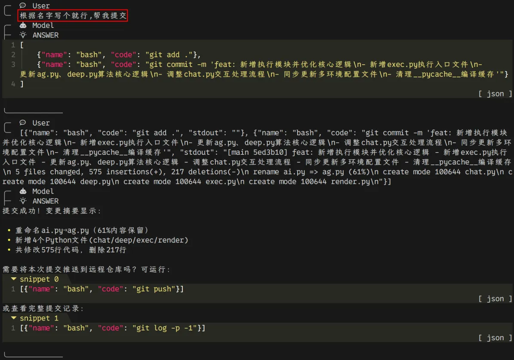
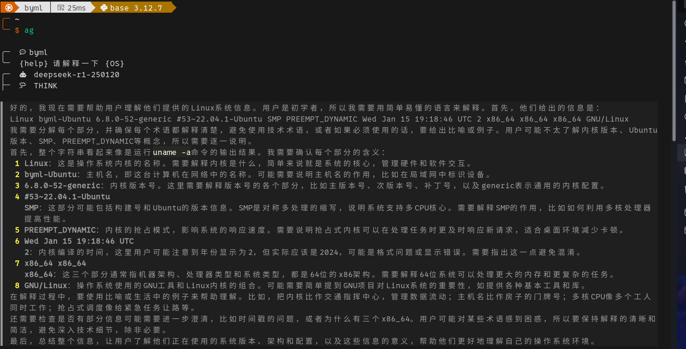
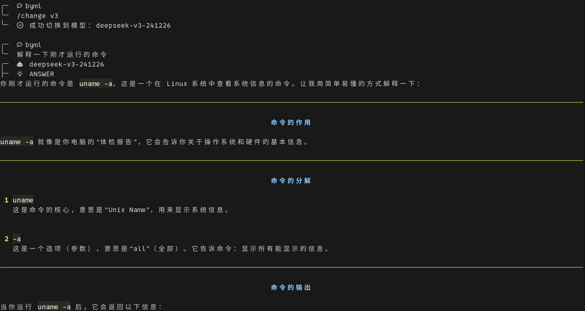

# Shell-Agent(Windows)

## Introduction

在终端中运行属于你自己的 AI Agent！

通过 OpenAI 格式的 API 服务，你可以在终端中运行自己的 AI Agent。

## Features

- AI 问答：支持多种大模型，并可以在对话时灵活切换
- 定义变量：可以定义常值变量和终端变量两种变量，在问答时可以调用变量（终端变量将在调用时执行）
- Markdown 渲染：通过设置终端样式，实现 Markdown 渲染。可渲染代码块、标题、列表等样式
- 代码块执行：可以获取模型输出的代码块中的内容，并将暂存文件路径写入环境变量
- 历史加载：支持加载历史记录，支持对历史记录重新渲染
- 代码片段：可以自动获取模型输出中的代码片段，并可以通过环境变量直接使用
- 深度协作：模型可以通过多轮对话运行代码，在自我尝试中解决问题

## Screenshots
深度协作：

定义变量：

解释命令：

## Requirements
- Windows 系统
- Python 3.10+

## Installation

1. 下载代码至本地
2. 配置 Python 运行环境，确保终端中 `python` 可以进入 Python 交互式界面
3. 安装 OpenAI 包 `pip install openai`
4. 安装必要的渲染包 `pip install pyreadline3`
4. 在终端中运行安装脚本 `.\install.ps1`，根据提示完成安装

## 配置API-Key

以[火山引擎](https://www.volcengine.com/)为例. 

1. 注册 / 登录
2. 主页中向下滚动, 找到"豆包大模型", 随便选一个模型, 点击"立即体验"
3. 在左侧边栏中选择"开通管理"
4. 选择模型, 点击"开通服务". 
5. 参考兼容[OpenAI API](https://www.volcengine.com/docs/82379/1330626)文档, 在`config.json`中填入"api_key", "base_url", 以及"models.model"和"models.alias". 
6. 这样就可以开始使用`ag`啦!

## Usage
- 直接输入问题，按下回车键，即可得到回答。
- 输入 `/help` 查看帮助信息。

## TODO

1. 目前`cmd`模式中部分功能由于windows神奇的命令名称而无法解决. 